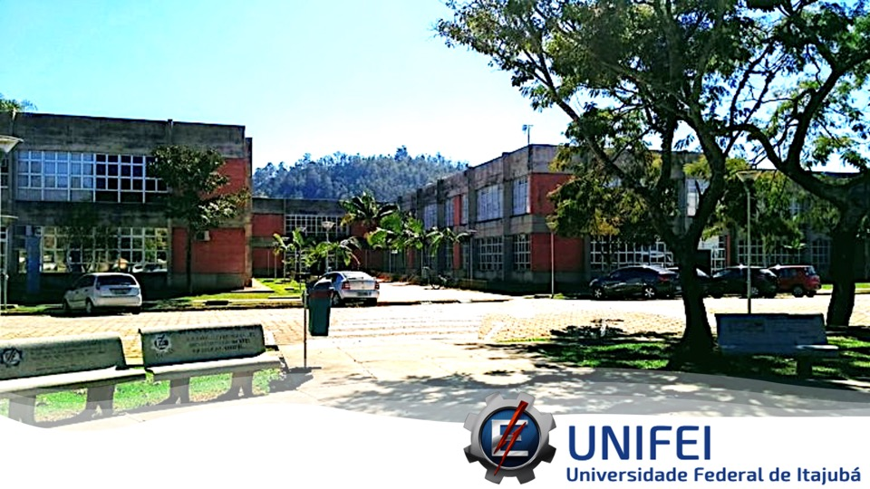

# UNIFEI-IESTI01-TinyML-2022.1
## TinyML - Machine Learning for Embedding Devices
### 1st Semester

<figcaption><a href='https://unifei.edu.br/iesti/'>Instituto de Engenharia de Sistemas e Tecnologias da Informação – IESTI - Campus de Itajubá</a></figcaption>

For the previous versions of IESTI01 courses, please visit: 
+ [1st Semester 2021 - UNIFEI-IESTI01-TinyML-2021.1](https://github.com/Mjrovai/UNIFEI-IESTI01-T01-2021.1)
+ [2nd Semester 2021 - UNIFEI-IESTI01-TinyML-2021.2](https://github.com/Mjrovai/UNIFEI-IESTI01-T01-2021.2)

## Material 
- All material will be uploaded to this repo at the classes' base
- Slides, Noteboooks, Code and Docs in English 
- Videos in Portuguese

### Optional pre-course activities:
+ Pre-course:  : [[Suggested readings]](https://github.com/Mjrovai/UNIFEI-IESTI01-T01-2021.1/tree/main/00_Curso_Folder/0_Pre-Course)
+ Pre-course:  : [[Jupyter Notebook, CoLab and Python Review]](https://github.com/Mjrovai/UNIFEI-IESTI01-T01-2021.1/tree/main/00_Curso_Folder/1_Fundamentals/Class_4)

### Parte 1: Fundamentals 
+ Class 1 - About the Course and Syllabus [[Slides]](00_Curse_Folder/1_Fundamentals/Class_01/IESTI01_TinyML_class_1.pdf) [[Video]](https://youtu.be/5ny2xUIr8Do)
+ Class 2 - Introduction to TinyML [[Slides]](00_Curse_Folder/1_Fundamentals/Class_02/IESTI01_TinyML_class_2.pdf) [[Video]](https://youtu.be/0Ek4cg9sp8Y)
+ Class 3 - TinyML - Challenges [[Slides]](/00_Curse_Folder/1_Fundamentals/Class_03/IESTI01_TinyML_class_3.pdf) [[Video]](https://youtu.be/4LJzGT0t-Ts)
+ Class 4 - Jupyter Notebook, CoLab and Python Review [[Notebooks]](00_Curse_Folder/1_Fundamentals/Class_04/notebooks) [[Docs]](00_Curse_Folder/1_Fundamentals/Class_04/docs)  [[Video]](https://youtu.be/ndUf5HXRHwU) 
+ Class 5 - The Machine Learning Paradigm [[Slides]](/00_Curse_Folder/1_Fundamentals/Class_05/IESTI01_TinyML_class_5.pdf) [[Notebooks]](00_Curse_Folder/1_Fundamentals/Class_05) [[Docs]](00_Curse_Folder/1_Fundamentals/Class_05/docs) [[Video]](https://youtu.be/XGcM87-Ubrc)
+ Class 6 - The Building Blocks of Deep Learning (DL) - Introduction [[Slides]](/00_Curse_Folder/1_Fundamentals/Class_06/IESTI01_TinyML_class_6.pdf) [[Notebooks]](00_Curse_Folder/1_Fundamentals/Class_06) [[Docs]](00_Curse_Folder/1_Fundamentals/Class_06/docs) [[Video]](https://youtu.be/tesduiurapA)
+ Class 7 - The Building Blocks of DL - Regression with DSS [[Slides]](/00_Curse_Folder/1_Fundamentals/Class_07/IESTI01_TinyML_class_7.pdf) [[Notebooks]](00_Curse_Folder/1_Fundamentals/Class_07) [[Docs]](00_Curse_Folder/1_Fundamentals/Class_07/docs) [[Video]](https://youtu.be/OxIC8Ac1X30)
+ Class 8 - The Building Blocks of DL - Classification with DSS [[Slides]](/00_Curse_Folder/1_Fundamentals/Class_08/IESTI01_TinyML_class_8.pdf) [[Notebooks]](00_Curse_Folder/1_Fundamentals/Class_08) [[Docs]](00_Curse_Folder/1_Fundamentals/Class_08/docs) [[Video]](https://youtu.be/XVu8N9jbiLA)
+ Class 9 - The Building Blocks of DL - DNN Recap, Datasets and Model Performance Metrics [[Slides]](/00_Curse_Folder/1_Fundamentals/Class_09/IESTI01_TinyML_class_9.pdf) [[Notebooks]](00_Curse_Folder/1_Fundamentals/Class_09) [[Docs]](00_Curse_Folder/1_Fundamentals/Class_09/docs) [[Video]](https://youtu.be/_E6M-yK_Yy8)
+ Class 10 - Introducing Convolutions (CNN) [[Slides]](/00_Curse_Folder/1_Fundamentals/Class_10/IESTI01_TinyML_class_10.pdf) [[Notebooks]](00_Curse_Folder/1_Fundamentals/Class_10) [[Docs]](00_Curse_Folder/1_Fundamentals/Class_10/docs) [[Video]](https://youtu.be/IiwlEr8Zf2s)
+ Class 11 - Image Classification using CNN [[Slides]](/00_Curse_Folder/1_Fundamentals/Class_11/IESTI01_TinyML_class_11.pdf) [[Notebooks]](00_Curse_Folder/1_Fundamentals/Class_11) [[Docs]](00_Curse_Folder/1_Fundamentals/Class_11/docs) [[Video]](https://youtu.be/-JRPJIe6-18)
+ Class 12 - Introduction to Edge Impulse – CNN with Cifar-10 [[Slides]](/00_Curse_Folder/1_Fundamentals/Class_12/IESTI01_TinyML_class_12.pdf) [[Notebooks]](00_Curse_Folder/1_Fundamentals/Class_12) [[Video]](https://youtu.be/tFfo8-mkYGw)
+ Class 13 - Preventing Overfitting [[Slides]](/00_Curse_Folder/1_Fundamentals/Class_13/IESTI01_TinyML_class_13.pdf) [[Notebooks]](00_Curse_Folder/1_Fundamentals/Class_13) [[Docs]](00_Curse_Folder/1_Fundamentals/Class_13/docs) [[Video]](https://youtu.be/ihFunJ5upvs)
+ Class 14 - Fundamentals wrap-up and Application’s preview [[Slides]](/00_Curse_Folder/1_Fundamentals/Class_14/IESTI01_TinyML_class_14.pdf) [[Docs]](00_Curse_Folder/1_Fundamentals/Class_14/docs) [[Video]](https://youtu.be/Otk1TvqeTzk)
  
### Parte 2: Applications & Deploy
+ Class 15 - ML Applications Overview - AI Lifecycle and ML Workflow [[Slides]](/00_Curse_Folder/2_Applications_Deploy/Class_15/IESTI01_TinyML_class_15.pdf)  [[Video]](https://youtu.be/ojyj7wShxNQ)
+ Class 16 - Introduction to TFLite and TFLite-Micro [[Slides]](/00_Curse_Folder/2_Applications_Deploy/Class_16/IESTI01_TinyML_class_16.pdf) [[Notebooks]](00_Curse_Folder/2_Applications_Deploy/Class_16) [[Docs]](00_Curse_Folder/2_Applications_Deploy/Class_16/docs) [[Video]](https://youtu.be/SYdWTR-NhG4)
  + Class 16a - EdgeML with TensorFlow Lite (RaspberryPi Demo) [[Slides]](/00_Curse_Folder/2_Applications_Deploy/Class_16/EdgeML-Demo/IESTI01_TinyML_class_16a.pdf) [[Video]](https://youtu.be/lZ1W7MnJFD4)
+ Class 17 - TinyML Kit Overview - HW and SW Installation & Test [[Slides]](/00_Curse_Folder/2_Applications_Deploy/Class_17/IESTI01_TinyML_class_17.pdf) [[Notebooks]](00_Curse_Folder/2_Applications_Deploy/Class_17) [[Docs]](00_Curse_Folder/2_Applications_Deploy/Class_17/docs)  [[Video]](https://youtu.be/waNy7s6y3jc)
+ Class 18 - TFLite-Micro Overview & Hello World Code Walkthrough [[Slides]](/00_Curse_Folder/2_Applications_Deploy/Class_18/IESTI01_TinyML_class_18.pdf) [[Code]](00_Curse_Folder/2_Applications_Deploy/Class_18) [[Docs]](00_Curse_Folder/2_Applications_Deploy/Class_18/docs) [[Video]](https://youtu.be/uOYFo-1xC3o)
+ Class 19 - Motion Classification - Introdution [[Slides]](/00_Curse_Folder/2_Applications_Deploy/Class_19/IESTI01_TinyML_class_19.pdf) [[Video]](https://youtu.be/44cl22eWvks)
+ Class 20 -  Motion Classification using MCU [[Slides]](/00_Curse_Folder/2_Applications_Deploy/Class_20/IESTI01_TinyML_class_20.pdf) [[Code]](00_Curse_Folder/2_Applications_Deploy/Class_20) [[Video]](https://youtu.be/OqHms7spYMI)
+ Class 21 - Lecturer with Dr. Marco Zennaro, ICTP, Italy [[Slides]](/00_Curse_Folder/2_Applications_Deploy/Class_21/IESTI01_TinyML_class_21.pdf) [[Video]](https://youtu.be/uUmL0BHnXvs)
+ Class 22 - Anomaly Detection using MCU [[Slides]](/00_Curse_Folder/2_Applications_Deploy/Class_22/IESTI01_TinyML_class_22.pdf) [[Code]](00_Curse_Folder/2_Applications_Deploy/Class_22) [[Docs]](00_Curse_Folder/2_Applications_Deploy/Class_22/docs) [[Video]](https://youtu.be/eZtsuHPp6Gg)
+ Class 23 - Keyword Spotting - Introduction [[Slides]](/00_Curse_Folder/2_Applications_Deploy/Class_23/IESTI01_TinyML_class_23.pdf) [[Code]](00_Curse_Folder/2_Applications_Deploy/Class_23) [[Docs]](00_Curse_Folder/2_Applications_Deploy/Class_23/docs) [[Video]](https://youtu.be/y1AXqx7YDA4)
+ Class 24 - Lab KWS using MCU [[Slides]](/00_Curse_Folder/2_Applications_Deploy/Class_24/IESTI01_TinyML_class_24.pdf) [[Code]](00_Curse_Folder/2_Applications_Deploy/Class_24) [[Video]](https://youtu.be/MptxjTzs4Sk)
+ Class 25 - Collecting Data with Edge Impulse Studio [[Slides]](/00_Curse_Folder/2_Applications_Deploy/Class_25/IESTI01_TinyML_class_25.pdf) [[Code]](00_Curse_Folder/2_Applications_Deploy/Class_25) [[Video]](https://youtu.be/EZlwH_eoxMw)
+ Class 26 - Visual Wake Words (VWW) - Introduction [[Slides]](/00_Curse_Folder/2_Applications_Deploy/Class_26/IESTI01_TinyML_class_26.pdf) [[Code]](00_Curse_Folder/2_Applications_Deploy/Class_26) [[Docs]](00_Curse_Folder/2_Applications_Deploy/Class_26/docs) [[Video]](https://youtu.be/k2-3lDb1V-w)
  +  Class 26a - Person Detection (VWW) - Application [[Slides]](/00_Curse_Folder/2_Applications_Deploy/Class_26a/IESTI01_TinyML_class_26a.pdf) [[Docs]](00_Curse_Folder/2_Applications_Deploy/Class_26a/doc) [[Video]](https://youtu.be/JCBPy5HQEZM)
+ Class 27 - Image Classification using Edge Impulse Studio [[Slides]](/00_Curse_Folder/2_Applications_Deploy/Class_27/IESTI01_TinyML_class_27.pdf) [[Code]](00_Curse_Folder/2_Applications_Deploy/Class_27) [[Video]](https://youtu.be/NG9bAxY2Ijo)
+ Class 28 - Responsible AI & Course Wrap-up [[Slides]](/00_Curse_Folder/2_Applications_Deploy/Class_28/IESTI01_TinyML_class_28.pdf) [[Docs]](00_Curse_Folder/2_Applications_Deploy/Class_28/docs) [[Video]](https://youtu.be/p5dvP_HEc5M)
+ Class 29 and 30 - Group Presentations

### Group Projects
+ [[Proposals]](/00_Curse_Folder/Group%20Project/propostas/)
+ [[Final Reports]](/00_Curse_Folder/Group%20Project/final_reports/)

## Relevancia do aprendizado do TinyML
Como sabemos, os microcontroladores (ou MCUs) são componentes eletrônicos muito baratos, geralmente com apenas alguns kilobytes de RAM e projetados para consumir pequenas quantidades de energia. Hoje em dia, os MCUs podem ser encontrados incorporados em quase todos os dispositivos residenciais, médicos, automotivos e industriais. Estima-se que mais de 40 bilhões de microcontroladores serão vendidos este ano e provavelmente centenas de bilhões deles esteja em serviço atualmente. Mas, curiosamente, esses dispositivos não recebem muita atenção porque muitas vezes são usados apenas para substituir funcionalidades que os sistemas eletromecânicos mais antigos faziam em carros, máquinas de lavar ou controles remotos.

Mais recentemente, com a era da IoT (Internet das Coisas), uma parte significativa desses MCUs está gerando “quintilhões” de dados, que em sua maioria, não são utilizados devido ao alto custo e complexidade de sua transmissão de dados (largura de banda e latência).

Por outro lado, nas últimas décadas, assistimos ao desenvolvimento de modelos de Aprendizado de Máquina (também conhecido como Inteligência Artificial) treinados com "toneladas" de dados e em poderosos mainframes. Mas o que está acontecendo hoje é que, de repente, tornou-se possível, à partir de sinais "ruidosos" e complexos como imagens, áudio ou acelerômetros e extrair significado deles através do uso de redes neurais. E o que é mais importante, é que podemos executar esses modelos de redes neurais em microcontroladores e sensores usando muito pouca energia e assim, interpretando muito mais dos dados de sensores que estamos atualmente ignorando. Este é o TinyML, uma nova área que permite extrair "inteligência de máquina" bem no mundo físico (onde os dados são gerados).

## Visão geral do curso

TinyML é um curso introdutório na interseção entre o Aprendizado de Máquina (Machine Learning) e dispositivos embarcados (Embedded Devices). A difusão de dispositivos embarcados com ultra-baixo consumo de energia (da ordem de miliwatts), juntamente com a introdução de frameworks de aprendizado de máquina dedicados a dispositivos embarcados, como TensorFlow Lite para Microcontroladores (TF Lite Micro), permitirão a proliferação em massa de dispositivos IoT potencializados por IA (“AioT”). 

O crescimento explosivo do aprendizado de máquina e a facilidade de uso de plataformas como TensorFlow (TF) o tornam um tópico de estudo indispensável para estudantes de Engenharia Eletrônica, da Computação e Controle & Automação. 

O TinyML difere do aprendizado de máquina convencional (por exemplo, servidor - nuvem) porque requer não apenas conhecimentos em software, mas também conhecimentos em hardware integrado. Este curso procura fornecer uma base para o entendimento deste campo emergente.

A atual versão deste curso, pioneiro na América Latina, tem como principais referências:
+ [Harvard School of Engineering and Applied Sciences - CS249r: Tiny Machine Learning](https://sites.google.com/g.harvard.edu/tinyml/home)
+ [Professional Certificate in Tiny Machine Learning (TinyML) – edX/Harvard](https://www.edx.org/professional-certificate/harvardx-tiny-machine-learning)
+ [Introduction to Embedded Machine Learning - Coursera/Edge Impulse](https://www.coursera.org/learn/introduction-to-embedded-machine-learning)
+ [Computer Vision with Embedded Machine Learning - Coursera/Edge Impulse](https://www.coursera.org/learn/computer-vision-with-embedded-machine-learning)
+ Fundamentals text book: ["Deep Learning with Python" by François Chollet](https://www.manning.com/books/deep-learning-with-python)
+ Applications & Deploy text book: ["TinyML" by Pete Warden, Daniel Situnayake](https://www.oreilly.com/library/view/tinyml/9781492052036/)

IESTI01 faz parte do [TinyML4D](https://tinymlx.org/TinyML4D/), uma iniciativa para tornar a ensino do TinyML disponível para todos em todo o mundo.

## Tópicos do curso

+	Fundamentos de IoT
+	Fundamentos de aprendizado de máquina (ML)
+	Fundamentos de Deep Learning (DL)
+	Como coletar dados para ML
+	Como treinar e implantar modelos de ML
+	Noções básicas sobre ML embarcado
+	O código por trás de alguns dos aplicativos mais amplamente utilizados no TinyML
+	Casos reais de aplicação do TinyML na indústria
+	Princípios de reconhecimento automático de fala (KeyWord Spotting apps como Alexa, Hey Google, Siri, etc.)
+	Princípios do classificação automática de imagens (Visual Wake Words)
+	Conceito de detecção de anomalias e modelos de ML aplicáveis 
+	Princípios de Engenharia de Dados aplicado ao TinyML
+	Visão geral do hardware de dispositivos baseados em microcontroladores
+	Visão geral do software por trás de dispositivos baseados em microcontroladores
+	Projetos reais utilizando plataformas de mercado
+	Design, desenvolvimento e Implantação de uma IA responsável

## Carga horária: 
+	30hs (Classes de 2hs, durante 15 semanas) 
+	15hs de tarefas/labs
+	15hs em pesquisas e estudos individuais + trabalho final (em grupo)

## Processo de aprovação:
+ Participação individual em classe (Quiz semanal): 20%
+	Code Assignments (ML/DL) (Jupyter Notebook / CoLab): 25%
+	Projetos práticos (Relatórios de Laboratórios): 25%
+	Projeto Final em Grupo(com apresentação): 30%

## Pré-requisitos
+ Conhecimentos do idioma inglês (leitura).
+ Conhecimentos básicos de programação em  C/C++ (Arduino IDE) e Python. Todas as tarefas de classe envolverão uma ou ambas linguagens de programação.
+ Familiaridade com ferramentas de linha de comando em Mac, Windows ou Linux. Os projetos exigirão algumas operações em um terminal.
+ Noções de Algebra linear, análise de sinais, probabilidade básica e estatística. Muitos tópicos de ML giram em torno de compreender operações e notação de vetores e matrizes, bem como conceitos de distribuições gaussianas, médias, desvios-padrão etc.

## Metodologia/Recursos: 
+ As aulas serão ministradas de maneira remota e ao vivo (aulas síncronas) pela plataforma Zoom, todas as quartas-feiras das 13:30h às 15:30h. As gravações das aulas estarão disponíveis aos alunos para revisão. 
+ Exercícios e projetos poderão ser desenvolvidos em computadores pessoais com TensorFlow V.2x instalados ou utilizando-se de ferramentas on-line como [Google CoLab](https://colab.research.google.com/notebooks/intro.ipynb).
+ Modelos reais de TinyML serão desenvolvidos e treinados utilizando-se do [Edge Impulse Studio](https://www.edgeimpulse.com/).
+ Para a captura inicial de dados, deployment dos modelos treinados e familiarização das ferramentas de mercado, serão utilizados inicialmante smart-phones pessoais dotados de pelo menos sensores do tipo: acelerômetro, microfone e camera.
+ Na segunda parte do curso será utilizado um [Kit](https://store-usa.arduino.cc/products/arduino-tiny-machine-learning-kit) composto de um Arduino BLE Sense (Cortex-M4) e uma camera digital modelo OV7675 (Cada aluno receberá um Kit, disponibilizado pela universidade para seu uso pessoal durante o decorrer do curso). 

## Professor do curso:
+ [Marcelo José Rovai](http://lattes.cnpq.br/4234592863079468)

## Supervisão e apoio:
+ [José Alberto Ferreira](http://lattes.cnpq.br/8319509175327154)

